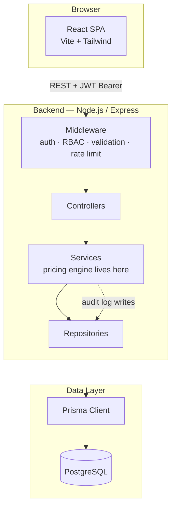
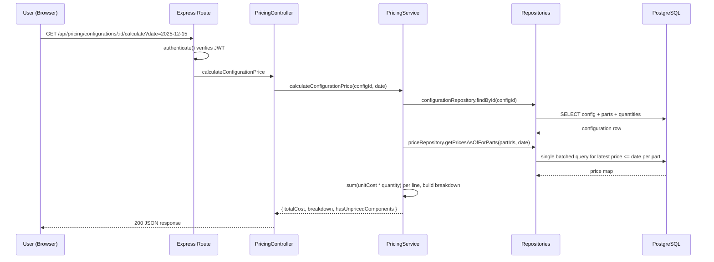

# System Design

## Section 6 — System Design

### Stack and why each piece was chosen

| Layer | Choice | Why |
|---|---|---|
| Frontend framework | React 18 + TypeScript | Component model fits the page structure naturally (parts table, configuration builder, calculator); TypeScript catches integration bugs against the API contract at compile time rather than runtime. |
| Build tool | Vite | Near-instant dev server start and HMR; minimal config compared to webpack for a project this size. |
| Styling | TailwindCSS | Fast to build a consistent, utility-driven design system without hand-rolling CSS files per component; easy to keep the industrial/utilitarian visual language consistent across many screens. |
| Server state | React Query | The app is almost entirely server-state-driven (parts, configs, prices) — React Query gives caching, request deduplication, and automatic invalidation-on-mutation for free, instead of hand-rolled `useEffect` fetch logic. |
| Forms | React Hook Form + Zod | Uncontrolled-by-default forms perform better with larger forms (e.g. configuration builder); Zod schemas are shared in spirit with the backend's validation schemas, so the "shape of valid input" is defined once per layer and stays in sync by convention. |
| Backend runtime | Node.js + Express + TypeScript | Express is minimal and well-understood, ideal for a clearly-bounded REST API; TypeScript end-to-end means the API's request/response shapes are explicit and checked. |
| Database | PostgreSQL | Relational integrity (foreign keys, unique constraints) is exactly what this domain needs — parts, prices, and configurations have real relationships that benefit from enforcement at the DB level, not just app code. |
| ORM | Prisma | Type-safe queries generated directly from the schema; migrations are declarative and reviewable; the `schema.prisma` file doubles as readable documentation of the data model. |
| Auth | JWT | Stateless — no server-side session store needed, which keeps the API horizontally scalable. Tradeoff (token can't be instantly revoked) is accepted and documented in `SECURITY_AND_PERFORMANCE.md`. |
| Testing | Jest + Supertest | Industry-standard for Node/TS; Supertest allows route-level testing against the real Express app without binding a port. |
| API docs | Swagger/OpenAPI via swagger-jsdoc | Docs live next to the route definitions as JSDoc comments, so they're far less likely to drift out of sync than a hand-maintained separate spec. |

### Architecture diagram



### Request flow for the pricing calculation (the core feature)



### Database ER diagram

```mermaid
erDiagram
    User ||--o{ BicycleConfiguration : creates
    User ||--o{ PartPriceHistory : records
    User ||--o{ AuditLog : performs

    Part ||--o{ PartPriceHistory : "has price points"
    Part ||--o{ ConfigurationPart : "used in"

    BicycleConfiguration ||--o{ ConfigurationPart : contains

    User {
        uuid id PK
        string name
        string email UK
        string passwordHash
        enum role
        boolean isActive
    }

    Part {
        uuid id PK
        string name
        enum category
        enum status
        string sku UK
    }

    PartPriceHistory {
        uuid id PK
        uuid partId FK
        decimal cost
        datetime effectiveDate
        uuid changedById FK
        string note
    }

    BicycleConfiguration {
        uuid id PK
        string name
        string modelCode UK
        boolean isActive
        uuid createdById FK
    }

    ConfigurationPart {
        uuid id PK
        uuid configurationId FK
        uuid partId FK
        int quantity
    }

    AuditLog {
        uuid id PK
        uuid userId FK
        enum action
        string entityType
        string entityId
        json metadata
    }
